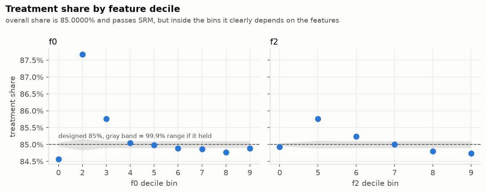
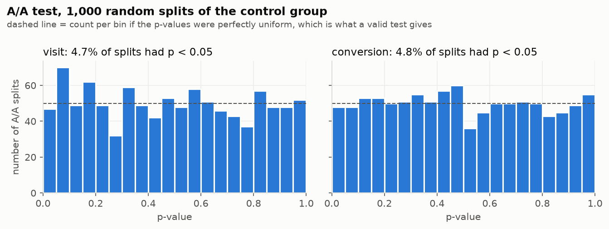
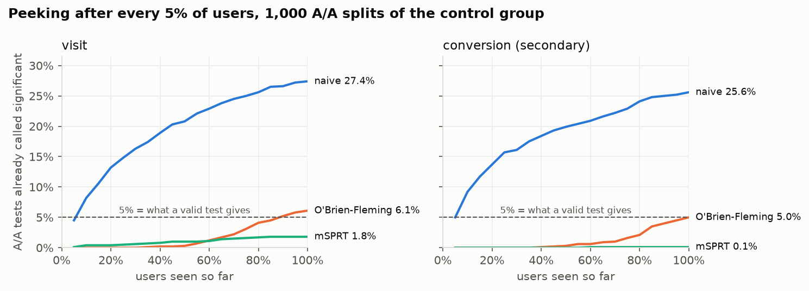
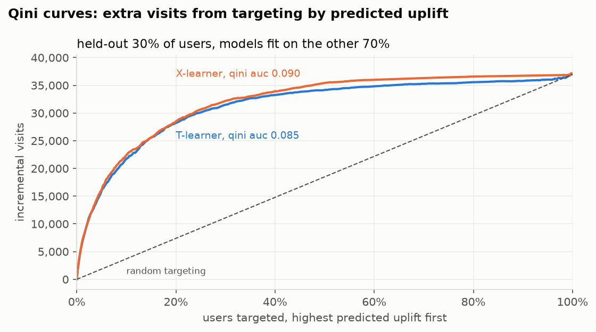

# ExpLab

[](https://github.com/shreybhavaraju/ExpLab/actions/workflows/ci.yml)

ExpLab is an experiment readout engine. It takes a randomized experiment and returns **SHIP**, **DON'T SHIP** or **INCONCLUSIVE** with the reasons, and it refuses to give a verdict when the data can't support one: when the split doesn't match the design (SRM), when the arms already differ before treatment, when the primary metric is underpowered, or when the CI covers both a meaningful gain and a meaningful loss. It runs on the [Criteo uplift dataset](https://huggingface.co/datasets/criteo/criteo-uplift), a real randomized ad experiment with 13.98M users. Metrics are defined once in a DuckDB SQL layer, the statistics are written from scratch with NumPy/SciPy and checked against statsmodels / SciPy / scikit-uplift in the tests, and every method is validated against a simulation where the right answer is known.

Run the app locally with `streamlit run app/streamlit_app.py`: pick a metric and a segment and you get the readout, the trust checks and the verdict.

## The verdict

On the full Criteo data ExpLab says **INCONCLUSIVE** for all three metrics. The effect is big and the CIs are tight; what blocks the verdict is a failed trust check.

| metric | control | treatment | raw lift, 95% CI | adjusted lift | MDE | verdict |
|---|---|---|---|---|---|---|
| visit rate (primary) | 3.820% | 4.854% | +27.1% [+26.2%, +28.0%] | +18.1% to +19.9% | 1.05% | INCONCLUSIVE |
| conversion rate | 0.194% | 0.309% | +59.4% [+54.3%, +64.6%] | +41.0% to +51.1% | 4.76% | INCONCLUSIVE |
| conversions per visit (guardrail) | 5.07% | 6.36% | +25.5% [+21.5%, +29.4%] | | 4.64% | INCONCLUSIVE |

Lift CIs use the delta method; a bootstrap over users lands within 0.2 percentage points of them on every metric. "Adjusted" is the range between the CUPAC-adjusted estimate and a post-stratified one (f0 x f2 bins). MDE is the smallest relative lift the test detects 80% of the time at this sample size, so power is not the problem here.

### What surprised me

The overall sample ratio check passes almost too well: 11,882,655 of 13,979,592 users are treated, a share of 0.8500001 (SRM p = 0.999). But inside deciles of the pre-treatment features the share moves from 84.6% to 87.7%, which is over 50 standard errors off in the worst bin (chi-square p ~ 0 for every feature I checked). It's highest exactly where users visit the most.



Criteo's [paper](https://arxiv.org/abs/2111.10106) says the data is pooled from several incrementality tests that had different treatment ratios, which they corrected by subsampling every test to the same 85%, and that negatives were subsampled non-uniformly for privacy. Their own independence check (a classifier two-sample test) didn't flag anything; a chi-square inside feature bins does. Whatever the exact mechanism, treated users are over-represented among heavy visitors, so the raw difference in means overstates the effect. Stratifying on just two features takes the visit lift from +27% to +20%, and CUPAC (which ends up adjusting for the imbalance in the predicted outcome) takes it to +18%. Both adjustments only fix the imbalance that shows up in the features, though, and Criteo also subsampled by outcome, which nothing on the features can undo. So the size of the effect isn't identified by this data, and the balance check blocks a verdict in `decide.py`, same as SRM.

f0 bin 5 is the one segment where both SRM and balance pass, and there the engine does make a call: SHIP on visits, +18.9% [+14.3%, +23.5%]. That comes with a warning, since the segment is underpowered for a 5% lift (MDE 5.6%) and significant results from underpowered tests tend to be overstated. With CUPAC on, the MDE drops to 4.6% and the warning goes away (+15.3% [+11.6%, +18.9%]; CUPAC also pulls the estimate down a bit, the prediction is mildly unbalanced in that bin too).

## Plots

**A/A test.** 1,000 random 50/50 splits of the control group. 4.7% of them come out significant at 0.05 for visits (4.8% for conversions) and the p-values are flat (KS p = 0.24).



**Peeking.** Criteo has no timestamps, so arrival order is simulated by shuffling users, then the readout is checked after every 5% of them. Stopping at the first p < 0.05 calls 27.4% of A/A tests significant. An O'Brien-Fleming boundary brings that back to 6.1%, and an always-valid mSPRT to 1.8% (it's built for checking after every user, so with only 20 looks it's conservative).



**Who responds.** T-learner and X-learner on LightGBM, fit on 70% of users and scored on the held-out 30%. The Qini curve sorts users by predicted uplift and shows the incremental visits you'd get by treating the top k; the diagonal is random targeting. Qini AUC is 0.090 for the X-learner and 0.085 for the T-learner vs 0.002 for random scores (AUUC 0.035 / 0.033 vs 0.001). Treating only the top 20% by predicted uplift captures about 77% of the incremental visits, and the top decile's predicted uplift (+6.18pp) lines up with what's observed on held-out users (+6.16pp). Those observed numbers come from the same imbalanced data, so they're a bit optimistic.



## How it's validated

Each method is checked on a case where the answer is known. The pass conditions are in [validation/pass_conditions.md](validation/pass_conditions.md), committed before any of the checks were run.

| what | how | pass if | result |
|---|---|---|---|
| readout CIs | inject a known 5% lift into resampled control users, 1,000 reps at full arm sizes | coverage 93.5% to 96.5% | 95.9% / 96.0% visits, 93.8% / 94.1% conversions (diff / lift) |
| stats functions | pytest against statsmodels / SciPy / sklift on small inputs | match to 1e-6 | pass ([tests](tests/)), except MDE vs statsmodels' root-finder, which agrees to ~2e-5 relative because the closed form drops the wrong-direction tail |
| SRM check | randomly drop 2% of control users | check fails | p = 2e-159, fails |
| A/A false positives | 1,000 random splits of control | 3.5% to 6.5%, flat p-values | 4.7% visits, 4.8% conversions |
| CUPAC | the same A/A test with the adjustment on | 3.5% to 6.5%, CI narrower | 5.9% / 4.7%, visit CI 17% narrower |
| peeking | 20 looks on A/A data, 1,000 reps | naive > 10%, corrected ~5% | naive 27.4%, OBF 6.1%, mSPRT 1.8% |
| uplift models | real features, fake outcomes with a +3pt effect planted in the bottom 20% of f8 | planted segment ranked first, Qini beats random | both rank it first (85% of the X-learner's top 20% is the segment), Qini AUC 0.030 / 0.025 vs 0.002 +- 0.007 for random scores |
| decision layer | unit test per rule | right verdict and reason | pass ([test_decide.py](tests/test_decide.py)) |

The test suite (84 tests, synthetic data only) runs in CI on every push. A few of them are there to make sure the checks can fail: the A/A test catches a readout with a too-narrow CI, and the CUPAC tests show that an in-sample prediction leaks the treatment effect into the covariate and fakes a variance reduction, which is why it has to be out-of-fold.

## Methods, briefly

**Relative lift CI.** Lift is a ratio of two noisy means, so its CI comes from the delta method (derivation in the docstring of `readout.lift`). Dividing the absolute CI by the control mean ignores the noise in the control mean and came out ~20% too narrow on visits.

**CUPED / CUPAC.** Criteo has no pre-period metric, so the covariate X is an out-of-fold LightGBM prediction of the outcome from the 12 features:

```math
Y_{adj} = Y - \theta (X - \bar{X}), \quad \theta = \frac{\operatorname{Cov}(Y, X)}{\operatorname{Var}(X)}
```

The variance shrinks by about corr(X, Y)^2: 33% for visits (OOF AUC 0.95), 10% for conversions. X has to be out-of-fold, otherwise the model has seen each user's own outcome, which depends on treatment. Here the model is also trained on control users only: when the treatment share depends on the features, a model fit on both arms partly learns the treatment effect itself, and the adjustment then subtracts some of the real effect (a first version did that and got +15% instead of +18%).

**Sequential testing.** O'Brien-Fleming boundaries b_k = C sqrt(K/k) with C calibrated by simulation (C = 2.13 for 20 looks, so the first look needs |z| > 9.5). mSPRT uses the mixture likelihood ratio, i.e. a Bayes factor between "no effect" and "effect ~ N(0, tau^2)", and stops when it passes 1/alpha.

**Ratio metric.** Conversions per visit has the user as the randomization unit, so its variance comes from per-user sums (delta method). On Criteo the naive "every visit is an independent trial" SE happens to be exactly right, because every user has at most one visit (the algebra is in `scripts/ratio_pitfalls.py`). In a simulation where users come back several times, the naive CI covers the truth only 85% of the time vs 95% for the delta method.

**Bayesian view.** Beta posteriors per arm, P(treatment better) and a credible interval for the lift. At this sample size it agrees with the frequentist readout, and it inherits the same imbalance.

## Dataset and its limits

- 13,979,592 users, 12 anonymized pre-treatment features (f0 to f11), treatment (85/15), exposure, visit and conversion. Visit is the primary metric since conversions are rare (0.19% in control). Data license is CC BY-NC-SA 4.0.
- **No timestamps.** The peeking analysis uses a simulated arrival order (random shuffle), so it shows how peeking breaks a test, not anything about how this test actually ran.
- **Anonymized features.** Segments are "f0 bin 5", not something interpretable. Ties at the most common value merge some deciles, so f0 has 9 bins and f2 has 6.
- **Assignment vs exposure.** Everything is by assignment (intent-to-treat). Only 3.6% of treated users were actually shown an ad, and they aren't a random 3.6%: exposed users visit at 41% vs 3.8% in control, mostly because being active is what gets you into an ad auction. Comparing exposed users to control would credit the ad with that. The effect on users who actually saw an ad can still be backed out of the randomization, since control users can't be exposed: ITT / exposure rate = 1.03pp / 3.6% = about +29pp of visit probability, assuming assignment only matters through exposure (and it inherits the same imbalance).
- **Subsampled labels.** Criteo subsampled negatives non-uniformly so the original incrementality can't be recovered, so the rates here aren't real-world rates, and (see above) treatment isn't independent of the features.

## Running it

```bash
python -m venv .venv && source .venv/bin/activate
pip install -e ".[dev,app]"        # on macOS lightgbm also needs: brew install libomp
python -m explab.load              # downloads the 311MB csv, converts to parquet, prints a summary
pytest
```

The analysis scripts each write to `results/` and `figures/`:

```bash
python scripts/run_readout.py      # readout + bootstrap CIs (~5 min)
python scripts/run_trust.py        # SRM, A/A test, balance check (~3 min)
python scripts/run_power.py        # MDE, power curves, CI coverage (~10 min)
python scripts/run_cupac.py        # CUPAC predictions + A/A rerun (~4 min)
python scripts/run_peeking.py      # peeking simulation (~4 min)
python scripts/run_uplift.py       # T/X-learner, Qini, planted-effect check (~1-2 min)
python scripts/build_app_data.py   # per-segment sums for the app
python scripts/run_decision.py     # verdicts overall and per segment
python scripts/ratio_pitfalls.py
streamlit run app/streamlit_app.py
```

## Layout

```
sql/metrics.sql        metric definitions as DuckDB views (per arm)
sql/segments.sql       f0 / f2 decile bins, per-segment sums
explab/load.py         download, parquet, DuckDB connection
explab/readout.py      diff, lift (delta method), ratio metrics, bootstrap, post-stratification
explab/trust.py        SRM, balance check, A/A test
explab/power.py        MDE, simulated power, CI coverage
explab/variance.py     CUPED / CUPAC
explab/sequential.py   peeking simulation, O'Brien-Fleming, mSPRT
explab/uplift.py       T-learner, X-learner, Qini / AUUC
explab/bayes.py        Beta-binomial readout
explab/decide.py       SHIP / DON'T SHIP / INCONCLUSIVE
explab/report.py       glue used by the app and run_decision.py
app/streamlit_app.py   the app
memo/decision_memo.md  one-page writeup of the decision
```
